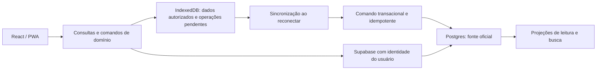

# Reflect Open: análise e aplicação no Odontoart

Análise realizada em **9 de outubro de 2026**.

**Recomendação:** adotar os padrões de busca, contexto, persistência e separação de responsabilidades do Reflect de forma incremental. Manter React/Vite/PWA e Supabase como base do Odontoart. O melhor primeiro incremento é **busca global com acesso ao histórico contextual da empresa**, acompanhado da organização da camada de consultas. Operação offline e IA vêm depois dos respectivos contratos de gravação e autorização.

## 1. Escopo, evidências e limites

Foram inventariados os dois repositórios e rastreados os caminhos centrais de interface, persistência, busca, IA, sincronização, permissões e testes. A análise foi além dos READMEs, confrontando documentação, implementações e configurações. Não equivale a uma auditoria linha a linha dos 1.893 arquivos versionados do Reflect ou a uma homologação funcional em produção.

| Base | Versão examinada |
|---|---|
| Reflect Open | `master`, commit `579cafc90cd49b33e8975b48b7358c551e9b258f`, de 09/10/2026; manifesto desktop `0.15.0-beta.5` |
| Odontoart | checkout local sobre `36a6d8446a1e2e0f47a0d5c1374230e6c12e7291`, de 01/09/2026 |

O Reflect foi clonado em diretório temporário fora deste repositório. Não foram instaladas suas dependências nem executadas suas aplicações ou suítes. No Odontoart, foram executados build, lint e os dois scripts de testes existentes. Não foram acessados dados operacionais, aplicadas migrations ou verificadas políticas do Supabase em produção. As quatro exclusões de GeoJSON já presentes no checkout foram preservadas.

Neste documento, **confirmado** descreve código/configuração inspecionados; **proposto** descreve trabalho futuro. Referências do Reflect apontam para o commit examinado, evitando mudanças silenciosas em `master`.

## 2. O que o Reflect Open oferece de fato

O Reflect é um aplicativo de conhecimento pessoal: captura cronológica, notas Markdown, ligações entre notas, recuperação por busca e IA sobre esse conteúdo. Sua arquitetura pressupõe uma pasta de arquivos controlada pelo usuário; o Odontoart coordena dados operacionais compartilhados entre pessoas com permissões diferentes.

### Arquitetura confirmada

| Camada | Implementação observada | Consequência para reaproveitamento |
|---|---|---|
| Interface | React, TypeScript, Vite, Tailwind, componentes de interface e paleta de comandos | Há afinidade com nossa stack; componentes ainda dependem dos contextos e comandos do Reflect |
| Editor | Meowdown, sessão de documento, autosave e reconciliação de alterações externas | Útil para notas comerciais; é excessivo para campos curtos ou estruturados |
| Núcleo | `packages/core`: Markdown, indexação, busca, IA, captura, sincronização | Boa referência de separação entre domínio, interface e efeitos |
| Transporte | `IpcBridge` substituível, com validação nas fronteiras | O núcleo não importa Tauri diretamente, mas depende de comandos implementados pelo host |
| Persistência nativa | Rust/Tauri, escrita de arquivos, observação de mudanças e keychain | Não pode ser transportada diretamente para uma PWA |
| Índice | SQLite, Kysely, FTS5 e `sqlite-vec`; migrations compartilhadas com a CLI | Precisaríamos adaptar a Postgres/IndexedDB; não trocar o banco principal por SQLite |
| IA | Camada de provedores, ferramentas de leitura, streaming e orçamento de contexto | Reaproveitar contratos e fluxo; execução e credenciais devem ser adaptadas ao servidor |
| Integrações | CLI Rust, extensão Chrome, host nativo, Git e iCloud | Úteis como exemplos de contratos e filas, mas inadequados como dependência inicial do Odontoart |
| Organização | pnpm/Turborepo e workspace Cargo; pacotes `core`, `db`, `modules`, `utils` e design system | Separar responsabilidades faz sentido; converter nosso projeto em monorepo agora não é necessário |

Os manifestos declaram versões mais novas de ferramentas do que as usadas aqui: por exemplo, TypeScript `~6.0.3` e Vite `^8.3.0` no Reflect, contra `~5.9.3` e `^7.3.1` no Odontoart. Isso reforça a necessidade de adaptação, sem atualização geral de dependências só para acompanhar o projeto de referência. Os pacotes internos do Reflect estão marcados como `private: true`; não são um SDK público pronto para instalar. [Manifestos e ponte IPC][R01] [R02] [R03] [R04]

### Fluxo completo de gravação e indexação

1. O editor mantém uma sessão de documento com estado de carregamento, alterações pendentes, erro e conflito.
2. O autosave organiza gravações sequenciais. A sessão distingue o texto em edição, a última versão persistida e a gravação em andamento.
3. A camada nativa escreve com arquivo temporário e substituição atômica, evitando truncamento por uma gravação interrompida.
4. Mudanças nos arquivos alimentam a indexação incremental. Comparações de horário e hash evitam trabalho redundante.
5. O índice projeta títulos, referências, texto, tarefas e informações para busca. A interface atualiza as consultas afetadas.
6. A busca semântica divide conteúdo em trechos e recalcula vetores somente para trechos alterados.

Há uma proteção adicional relevante: comandos carregam uma **geração da sessão do grafo**. Uma operação atrasada de uma pasta anterior não deve gravar na pasta atualmente aberta. No Odontoart, o equivalente seria impedir que respostas e operações pendentes de uma sessão/usuário anterior atualizassem o contexto atual. Isso complementa a autorização no servidor. [Sessão de edição][R05], [escrita nativa][R06], [indexação incremental][R07], [modelo de sessão][R08].

**Exceção que precisa ser preservada:** embora o SQLite seja majoritariamente um índice reconstruível, as tabelas `chat_*` guardam histórico de conversas que não deriva dos arquivos Markdown. O código de reconstrução limpa explicitamente as projeções e preserva esse histórico. Copiar a ideia de “apagar todo o cache” sem separar esses dados perderia informação. [Limpeza do índice][R09]

### Busca e recuperação

O Reflect reúne busca textual e semântica em um contrato `retrieve()`. A parte semântica usa embeddings locais com `all-MiniLM-L6-v2`, 384 dimensões, executados por Rust/ONNX. A combinação dos resultados usa Reciprocal Rank Fusion: combina posições nos rankings, evitando tratar escores diferentes como comparáveis.

A implementação também deduplica trechos por nota, aplica um corte de distância e mantém busca textual funcionando quando a etapa semântica falha. Consultas com filtros explícitos na paleta seguem o caminho de filtros, enquanto texto livre pode usar busca híbrida. [Recuperação][R10], [pipeline incremental][R11], [runtime de embeddings][R12], [paleta][R13].

O que podemos transportar é o desenho: identidade estável, resultado com trecho de origem, busca textual utilizável sozinha e vetores opcionais. O modelo, o corte de distância e os limites de resultados precisam ser avaliados com português, nomes empresariais, códigos e observações comerciais reais.

### IA e privacidade

O chat consulta ferramentas como `search_notes`, `read_notes`, `list_recent_notes`, `list_daily_notes` e `read_assets`. São ferramentas de leitura, com schemas de entrada, limites de resultados e limites de conteúdo. O mecanismo de chat limita a quantidade de rodadas e solicita que o modelo cite as notas consultadas. Isso é um padrão de recuperação fundamentada em fontes, não uma garantia de que toda resposta estará correta. [Ferramentas][R14], [streaming][R15], [instruções de resposta][R16].

A fronteira `CloudSafe` combina tipagem e verificações de execução. Antes de enviar conteúdo, há nova checagem da privacidade na fonte, porque um índice pode estar desatualizado. Uma falha de leitura bloqueia a liberação nessa etapa. [Controle de saída][R17]

Há limites importantes:

- `private: true` controla saída de conteúdo por determinados serviços; não substitui autorização entre usuários.
- Notas privadas continuam podendo integrar backup Git. A própria documentação explicita essa exceção.
- O Markdown local não ganha criptografia ponta a ponta por receber essa propriedade.
- Texto colado manualmente no chat não é automaticamente reconhecido como originado de uma nota privada.
- O parser de frontmatter é tolerante; metadados desconhecidos ou malformados podem assumir padrões. Essa tolerância de editor não deve definir permissões empresariais no Odontoart.

No Reflect, as chaves são do usuário e ficam no keychain. Aqui, uma chave corporativa de IA deve ficar em secrets do backend. Colocá-la em `VITE_*`, no bundle ou no armazenamento do navegador exporia a credencial. [Privacidade documentada][R18], [parser e propriedades][R19] [R20].

### Sincronização e captura

O motor Git serializa ciclos, trata divergências e converte falhas em estados de produto. O código de conflitos usa regras determinísticas, merge de três vias, tratamento de frontmatter e revisão dos casos restantes. A estratégia documentada de iCloud é uma alternativa ao Git para o mesmo grafo. Resolução de conflitos por IA aparece como direção adiada, não como capacidade a presumir. [Motor de sincronização][R21], [resolução de conflitos][R22], [estratégia e atualizações][R23].

A extensão Chrome tem uma ideia especialmente útil: **persistir antes de tentar entregar**. As capturas possuem identidade, fila durável e tentativas; entradas aceitas são preservadas quando o consumidor está indisponível. O host nativo recebe o material em disco e o aplicativo o processa. Esse padrão é mais relevante para nossas visitas offline do que o transporte nativo da extensão. [Fila][R24], [entrega][R25].

Áudio tem armazenamento por segmentos e cache de transcrições para evitar repetir trabalho concluído após falhas. Podemos adaptar o conceito para ditado de observações comerciais, com revisão pelo vendedor antes da gravação definitiva. Gravação, upload e transcrição são etapas distintas; os limites do provedor devem ser verificados quando houver implementação. [Sessão de áudio][R26]

### Qualidade e maturidade

Foram identificados 416 arquivos de testes pelo padrão `*.test.*`/testes Rust de integração; esse número não representa casos executados nem cobertura medida. O CI inclui lint, tipos gerados do banco, typecheck, build, testes Chromium e Rust. Há uma execução WebKit que, na configuração examinada, não integra o conjunto obrigatório `all-green`. [CI][R27]

Alguns documentos misturam etapas diferentes do produto:

- O README enfatiza Mac/iOS e diz que Windows está fora do escopo. O código já contém build e publicação Windows. Isso comprova infraestrutura versionada, sem comprovar por si só uma release Windows homologada.
- A documentação do design system traz afirmações do Reflect anterior, inclusive criptografia e produto comercial. Não serve como comprovação dessas características no rewrite.
- Orientações antigas mencionam parser/toolchain anteriores; os manifestos e imports atuais mostram Meowdown e a stack descrita acima.

Portanto, a referência para uma adaptação deve ser **código + testes + commit fixado**, com documentação como apoio. [Build multiplataforma][R28], [publicação Windows][R29], [origem do design system][R30].

## 3. O ponto de partida real do Odontoart

O projeto tem 304 arquivos versionados e 148 migrations SQL no checkout analisado. React/Vite/Tailwind, Supabase Auth/Postgres/Edge Functions e PWA já oferecem a base necessária para evoluir sem substituir a plataforma.

| Constatação | Evidência local | Implicação |
|---|---|---|
| Empresas são a referência cadastral central | [clientesApi](../src/lib/clientesApi.ts), [remoção da antiga tabela agenda](../supabase/migrations/2026040101_drop_agenda_table.sql) | Novas notas e referências devem usar `clientes.id` e `visits.id`; não recriar o cadastro legado |
| Já há histórico por empresa | `fetchClienteHistory` em [clientesApi](../src/lib/clientesApi.ts) | Um painel de contexto pode começar com dados existentes |
| Há observações e instruções comerciais | [tipos de cliente](../src/types/clientes.ts), [Visitas](../src/pages/Visitas.tsx) | Existe conteúdo útil para busca e resumos, sem criar primeiro uma base documental genérica |
| Dashboard pode usar banco de leitura separado | [supabaseDashboard](../src/lib/supabaseDashboard.ts), [sincronização](dashboard-sync.md) | Exibir atualização dos dados e distinguir projeção de fonte oficial |
| Já há sincronização incremental servidor-servidor | [Edge Function](../supabase/functions/sync-dashboard-incremental/index.ts) | Cursor, checkpoint e lock são ativos existentes; não confundir com suporte offline do celular |
| Há índices e consultas especializadas | [índices de busca](../supabase/migrations/2026040802_routes_search_indexes.sql), [agendaApi](../src/lib/agendaApi.ts) | Preservar otimizações; validar planos e resultados antes de introduzir nova busca |
| PWA faz precache do aplicativo | [configuração Vite](../vite.config.ts) | Aplicativo instalável não significa gravação operacional offline |
| Rascunhos já são preservados | [persistência de formulários](../src/hooks/useAutoFormDraftPersistence.ts), [rascunho de planejamento](../src/lib/routesModuleDraft.ts) | Evoluir rascunhos tipados e escopados; não duplicar essa função sem migração |
| Há cache e consultas espalhados pelas páginas | [Visitas](../src/pages/Visitas.tsx), [Dashboard](../src/pages/DashboardEstrategico.tsx), [localActions](../src/lib/localActions.ts) | Padronizar identidade, invalidação e descarte de caches |

O fluxo de conclusão de visita atual grava diretamente em `visits` e, conforme o caso, realiza outras chamadas para `visit_supervisor_register` e dados relacionados. Não foi encontrada uma fila durável de mutações da aplicação em IndexedDB. `localActions.ts`, apesar do nome, usa Supabase e cache em memória. Uma queda de rede entre etapas exige tratamento; uma futura fila offline precisa de um comando transacional no servidor, não apenas repetir o handler atual.

Há concentração de responsabilidades: `Agenda.tsx` tem 6.277 linhas físicas, `Clientes.tsx` 5.786 e `Visitas.tsx` 5.519. O tamanho não prova um bug, mas torna custoso acrescentar busca, autosave e IA diretamente nessas páginas. Extrair consultas e operações de domínio em pequenos incrementos prepara a evolução.

**Nomenclatura:** a orientação local mapeia o alias legado `rotas` para Agenda. O checkout ainda contém labels distintos no menu: `Rotas` em `/agenda` e `Agenda` em `/visitas`, além de redirecionar `/rotas` para `/agenda`. Por isso, esta análise usa “Agenda/planejamento” e “Agenda/visitas”, com caminhos explícitos, sem propor renomeação ou um domínio duplicado. [Rotas de navegação](../src/App.tsx), [menu](../src/layouts/AppLayout.tsx).

## 4. O que aproveitar, com prioridade

| Prioridade | Propriedade do Reflect | Aplicação proposta | Esforço relativo |
|---|---|---|---|
| P0 | Fronteiras explícitas entre fonte, projeção e contexto autorizado | Revisar leitura do Dashboard; definir contratos de consulta, cache e gravação | Médio |
| P1 | Busca e comandos em uma entrada única | Buscar empresa por nome/código/CNPJ e abrir histórico; atalhos para módulos permitidos | Médio |
| P1 | Backlinks e contexto lateral | Painel da empresa com visitas, instruções, observações e referências a registros | Médio |
| P1 | Cache com identidade e invalidação centralizadas | Atualizar detalhes e listas coerentemente após uma alteração | Médio |
| P2 | Persistir localmente antes de entregar | Agenda disponível sem rede e fila de conclusão de visitas | Alto |
| P2 | Notas cronológicas e modelos de captura | Diário comercial por vendedor/dia e notas vinculadas à empresa | Médio |
| P2 | Busca textual com semântica opcional | Encontrar observações por significado e termos próximos | Médio/alto |
| P3 | IA consultiva com fontes e limites | Resumir histórico, explicar pendências e preparar uma visita | Alto |
| P3 | Áudio com retomada | Ditado de observações com transcrição revisável | Médio/alto |
| P3 | Interfaces previsíveis para agentes | Ferramentas de leitura e, se houver demanda, API/MCP autenticados | Médio/alto |
| Posterior | Captura via extensão | Coletar referências comerciais durante navegação | Alto para o benefício inicial |
| Sem adoção inicial | Arquivos Markdown, Git/iCloud e Tauri como base operacional | Exigiria outra arquitetura de distribuição, identidade e colaboração | Alto |

Essas prioridades são uma avaliação de engenharia sobre o código e o domínio observados. Não são medição de retorno financeiro ou estimativa fechada de prazo.

## 5. Primeiro incremento recomendado: busca global e contexto da empresa

**Exemplo de uso:** o supervisor abre a busca, digita um código ou parte do nome, seleciona a empresa e vê cadastro, últimas visitas e instruções sem procurar o mesmo registro em diferentes telas. No celular, a busca tem um botão visível; no desktop, pode usar `Ctrl/Cmd+K`.

Implementação proposta:

1. Contrato de resultado com `entityType`, `entityId`, título, trecho e destino de navegação.
2. Busca inicial por códigos/CNPJ exatos, seguida de nomes e texto; preservar os filtros e índices já existentes.
3. Consultas executadas com a identidade do usuário. Um vendedor só recebe resultados que pode consultar, inclusive títulos, trechos e contagens.
4. Painel da empresa consumindo primeiro `fetchClienteHistory`, instruções e campos atuais. Introduzir notas novas apenas quando faltar informação que os campos existentes não representem bem.
5. Navegação por ID e estados de acesso negado/registro removido. Os links diretos para abrir registros precisam ser implementados e testados; não presumir que parâmetros de URL já suportam isso.
6. Paleta como componente de interface; consulta e navegação ficam fora do componente visual.

TanStack Query é uma opção compatível para centralizar consultas. O Odontoart usa TanStack Table, que é outra biblioteca, e ainda não declara React Query. Adotar somente onde houver ganho inicial, com chaves que incluam usuário, contexto de autorização e filtros, descarte no logout/troca de usuário e invalidação após gravação. Persistência de cache não resolve automaticamente fila offline, conflitos ou autorização. [Query keys oficiais][E01]

**Critério de entrega:** pesquisar e abrir a mesma empresa corretamente nos perfis autorizados, sem resultados de terceiros, com navegação por teclado/toque, resposta tardia incapaz de sobrescrever uma consulta mais recente e mensagem distinta para erro e ausência de resultados.

## 6. Notas, vínculos e propriedades estruturadas

Se “propriedades” também significa os campos de metadados do Reflect: o frontmatter aceita propriedades adicionais e modela campos como identidade, aliases, privacidade e fixação. Isso permite flexibilidade sem transformar todo o documento em formulário.

Para o Odontoart, o equivalente é combinar **relacionamentos tipados** com **conteúdo livre controlado**:

| Reflect | Proposta no Odontoart |
|---|---|
| Identidade da nota | UUID do registro; sem usar nome empresarial como identificador |
| Aliases e títulos | Nome/razão social/nome fantasia/código/CNPJ consultáveis; resolução final por ID |
| Nota diária | Registro comercial por autor e data em `America/Fortaleza` |
| Wiki links/backlinks | Referências por chaves estrangeiras a empresas e visitas, com lista de registros que as mencionam |
| `private` | Separar visibilidade entre usuários de autorização para processamento externo |
| Propriedades livres | `jsonb` validado somente para metadados acessórios, com versão do schema |
| Markdown | Texto de notas e exportação, mantendo campos operacionais em tabelas |

Um esquema mínimo **proposto**, ainda não criado:

- `commercial_notes`: ID, autor, empresa, visita opcional, data comercial, conteúdo, visibilidade, política de IA, versão e timestamps.
- Referências adicionais: adicionar tabelas de associação somente quando uma nota realmente precisar mencionar outras empresas/visitas; verificar permissão em cada destino.
- `search_documents`: projeção de conteúdo autorizado, com origem, ID estável, versão/hash e data de atualização.
- `document_chunks`: etapa posterior, com referência ao documento, posição, texto, hash e versão/modelo do embedding.

Regras como quantidade de vidas, conclusão, vendedor responsável, categoria, situação e controles da Fila continuam nos campos operacionais existentes. Permissões não devem vir de texto Markdown editável pelo usuário. Caso uma nota aponte para uma visita e uma empresa, validar a consistência entre ambos no servidor.

Não é necessário implantar um banco de grafos nem uma visualização de nós para oferecer backlinks. Consultas relacionais e um bom painel de histórico atendem o primeiro caso de uso.

## 7. Operação offline: o que falta e como adaptar

O objetivo proposto é: **o vendedor consegue consultar uma agenda previamente sincronizada, registrar sua execução sem sinal e acompanhar quando o servidor confirmou o envio**.



O desenho precisa contemplar:

- **Carga delimitada:** somente agenda/empresas necessárias ao usuário, com indicação de última sincronização.
- **Fila durável:** persistir a intenção antes de confirmar “salvo no dispositivo”; guardar ID da operação, autor, registro, versão-base, payload, tentativas e erro.
- **Idempotência no servidor:** o mesmo ID reenviado não pode duplicar o resultado. A associação do ID ao usuário e a aplicação da operação devem ocorrer na mesma transação.
- **Transação de domínio:** conclusão da visita e alterações relacionadas são confirmadas juntas. O frontend não reproduz uma sequência parcial de chamadas como unidade de sincronização.
- **Concorrência:** comparar versão-base com versão atual. Observações independentes podem ser adicionadas; contagens, conclusão ou redistribuição conflitantes exigem decisão explícita.
- **Estados claros:** salvo no dispositivo, aguardando envio, sincronizado, conflito e ação necessária.
- **Identidade:** dados e filas separados por usuário; autenticação e permissão revalidadas no envio. Sessão vencida interrompe envio até novo login.
- **Revogação e retenção:** limitar validade dos dados locais. Um aparelho desconectado não recebe revogações instantaneamente. Definir como tratar rascunhos pendentes no logout, sem exibi-los ao próximo usuário ou descartá-los silenciosamente.
- **Retomada confiável:** sincronizar ao abrir, recuperar conexão e solicitar manualmente. Não depender exclusivamente de execução em segundo plano do navegador.

O motor de conflito do Reflect trata documentos de texto. A regra “unir as duas versões” não é apropriada para `completed_vidas`, vendedor atribuído ou status de visita. Reaproveitamos a explicitação de estados e a preservação da intenção, com regras próprias para operações comerciais.

## 8. Busca semântica e IA adequadas ao nosso banco

A evolução recomendada é **busca exata/textual → busca híbrida avaliada → assistente de leitura**.

Para texto livre, Postgres oferece um caminho compatível com a arquitetura atual: busca textual e, posteriormente, `pgvector`, com combinação de rankings. A documentação oficial do Supabase descreve essa combinação. Ela é uma base técnica, não uma escolha automática de modelo ou parâmetros. [Busca híbrida oficial][E02]

O índice deve acompanhar atualizações e exclusões da origem, manter versão/hash, registrar o modelo usado e ser reconstruível. Falhas na indexação precisam ter retomada e visibilidade. A autorização deve alcançar os documentos e os trechos, antes de qualquer envio ao modelo. Se uma permissão ou política de IA mudou depois da indexação, a regra vigente deve prevalecer. [RAG com permissões][E03]

Contrato ilustrativo **proposto** para o assistente:

```text
buscar_empresas(consulta, filtros)
consultar_historico_empresa(cliente_id, periodo)
consultar_agenda(periodo, vendedor_autorizado)
consultar_resumo_visitas(periodo, filtros_autorizados)
ler_observacoes_autorizadas(ids)
```

Cada ferramenta usa schemas de entrada, paginação/limites, autorização e resposta estruturada. A identificação do usuário vem da sessão validada, nunca de um ID sugerido pelo modelo.

Fluxo proposto: PWA → Edge Function autenticada → consultas autorizadas → seleção de conteúdo permitido → provedor de IA → resposta com fontes. A credencial de IA fica no servidor. Consultas comuns devem usar cliente Supabase com contexto do usuário/RLS; qualquer operação privilegiada exige escopo explícito. Uma `service_role` não preserva automaticamente as permissões do usuário. [Autenticação de Edge Functions][E04]

Exemplos úteis:

- “Resuma o histórico desta empresa antes da visita.”
- “Quais pendências da minha agenda ainda não foram concluídas?”
- “Mostre observações relacionadas a dificuldade de contato.”
- “Compare as visitas realizadas no período e cite os registros usados.”

Totais e indicadores devem sair de consultas estruturadas, com período e fuso explícitos. Busca vetorial retorna amostras relevantes; não é base para contar todas as visitas. O modelo pode explicar os resultados, mas não inventar contagens a partir dos primeiros trechos encontrados.

As fontes devem carregar tipo de entidade, ID, versão/data e trecho utilizado. Links precisam abrir o registro autorizado correspondente. Conteúdo de notas é dado consultado, não instrução capaz de mudar permissões ou acionar operações. Mensagens “sem evidência suficiente” e “fonte desatualizada” fazem parte do comportamento esperado.

Iniciar com leitura e resumo. Propostas de edição podem ser apresentadas para revisão em uma etapa posterior, usando os mesmos comandos validados da aplicação. Não conceder ao modelo SQL arbitrário nem alteração direta de conclusão, agenda ou controles da Fila.

Controlar tamanho de contexto, rodadas, tempo, cancelamento, quantidade de chamadas e consumo por usuário. O Reflect já oferece exemplos úteis dessas fronteiras; metas de custo e latência do Odontoart precisam de um piloto medido.

## 9. Pré-requisitos encontrados na base atual

### Acesso ao Dashboard

O [SQL de políticas](sql/dashboard_rls_policies.sql) contém `FOR SELECT USING (true)` para `dash_visits`, `dash_aceite_digital`, `dash_clientes` e `dash_profiles`, sem restrição de role nessa política. O [cliente do Dashboard](../src/lib/supabaseDashboard.ts) é separado e usa chave pública, sem configuração de propagação da sessão principal nesse arquivo.

**Conclusão estática:** esse SQL permite a leitura de todas as linhas a quem possua o privilégio SQL correspondente. A exposição efetiva depende dos grants, views, políticas e configuração aplicados no ambiente. Não foi comprovada uma exposição em produção.

**Consequência para a proposta:** uma busca ou IA corporativa não deve assumir que o banco de Dashboard já filtra o universo consultável por usuário. Verificar a configuração aplicada e definir a fronteira autenticada de leitura antes de usar essa réplica como fonte. Sessões de projetos Supabase separados não devem ser tratadas como intercambiáveis sem uma estratégia de autenticação validada.

### Gravação e cache

A conclusão de visita envolve múltiplas chamadas em [Visitas](../src/pages/Visitas.tsx). O rascunho de planejamento usa uma chave global `routesModuleDraftV2`, enquanto o hook geral de formulários já distingue usuário e rota. É preciso preservar o que já está escopado e corrigir o escopo de novos caches/filas, especialmente em dispositivos compartilhados.

### Documentação e manutenção

O README local ainda descreve a antiga tabela `agenda` e um comando `import:agenda` não declarado no `package.json` atual. `rules.md` também contém referências de navegação que precisam ser confrontadas com `App.tsx`. Atualizar esse mapa evita criar recursos sobre estruturas removidas.

O projeto já tem tokens em `src/index.css`, tema claro/escuro e `DESIGN.md`. O ganho do Reflect está em organizar componentes reutilizáveis, estados, atalhos e acessibilidade. Não é necessário copiar sua identidade visual ou substituir os tokens existentes.

## 10. Plano de adoção verificável

| Etapa | Entrega | Pontos de entrada | Condição para avançar |
|---|---|---|---|
| 0. Base | Documentar domínios reais, avaliar políticas do Dashboard, extrair contratos de consultas e estabelecer baseline de qualidade | `App.tsx`, `src/lib`, SQL do Dashboard, CI | Regras de acesso e fonte oficial explícitas; checagens reproduzíveis |
| 1. Valor imediato | Busca global, abertura por ID e painel de contexto com dados existentes | `AppLayout`, componente novo de busca, `clientesApi`, Agenda/visitas | Busca correta por perfil, navegação acessível, cache coerente |
| 2A. Captura | Notas comerciais vinculadas, autosave tipado, histórico e templates simples | Feature nova de notas, migrations aditivas, painel de empresa | Notas não duplicam cadastro; autoria, versões e acesso verificados |
| 2B. Campo | Agenda local e conclusão offline piloto | IndexedDB, comandos de visitas, RPC transacional | Reenvio sem duplicação; conflito e expiração de sessão tratados |
| 3. Recuperação | Indexação incremental e busca híbrida opcional | Projeção de busca e processamento de embeddings | Conjunto de consultas em português mostra ganho sobre busca textual |
| 4. Assistente | IA de leitura com fontes, política de saída e limites | Edge Function, ferramentas de domínio, painel contextual | Nenhum dado fora do escopo; respostas verificáveis e custo medido |
| 5. Extensões | Ditado, API/CLI/MCP ou extensão conforme uso observado | Os mesmos serviços de domínio | Demanda comprovada e manutenção justificável |

Nomes de diretórios possíveis: `src/features/search`, `src/features/company-context`, `src/features/notes`, `src/features/offline` e `src/features/assistant`. São sugestões, não diretórios criados nesta análise. Separar primeiro o código tocado por uma entrega; uma refatoração integral prévia aumentaria o custo sem entregar valor imediato.

O piloto offline pode avançar antes da busca semântica caso perda de conectividade seja a maior dor da equipe. A captura de notas e o trabalho offline têm parte da base em comum, mas podem ser entregues separadamente.

## 11. Validação e critérios de qualidade

Resultado das verificações locais desta análise:

| Verificação | Resultado |
|---|---|
| `npm run build` | Passou, incluindo TypeScript, Vite e geração do service worker |
| Aviso da build | CSS gerado contém `fila:auto-register`, interpretado como propriedade desconhecida |
| `npm run test:fila-data-contrato` | Passou: 10 cenários e validações adicionais |
| `npm run test:kpi-sync-progress` | Passou |
| `npm run lint` | Falhou: 119 apontamentos, sendo 97 erros e 22 avisos |
| Testes do Reflect | Inspecionados por organização e casos associados; não executados |
| Browser, banco remoto e permissões implantadas | Não homologados nesta análise |

Os apontamentos já existiam no checkout analisado; nenhum arquivo da aplicação foi alterado. O lint deve ter uma estratégia explícita de redução e bloqueio de novas regressões. Não há base para dizer que o projeto está pronto para integrar tudo de uma vez apenas porque compila.

Para as futuras entregas, os testes mais importantes são comportamentais:

- Usuário A não recebe títulos, trechos, contagens ou cache do usuário B.
- Revogação de acesso e bloqueio de uso por IA prevalecem sobre um índice antigo.
- Reenvio da mesma operação offline não duplica efeitos; falha no meio de uma gravação não deixa metade da operação confirmada.
- Mudança simultânea de vendedor, data ou conclusão produz conflito tratado.
- Reconstrução do índice preserva notas, auditoria e histórico de conversas.
- Busca exata por código/CNPJ continua superior a uma semelhança textual aproximada.
- Consulta sem resultado não vira resposta inventada; totais são iguais aos retornados pelo banco.
- Datas “hoje”, “ontem” e períodos respeitam `America/Fortaleza`.
- Interface funciona por teclado e toque, diferencia rascunho de envio confirmado e informa falhas recuperáveis.

Medir antes/depois: tempo para localizar uma empresa, chamadas redundantes, latência de busca, taxa de resolução de pendências, idade da fila offline, conflitos e custo por resposta de IA. Não foram medidos esses ganhos neste trabalho.

## 12. Reuso de código, licença e decisão

A licença principal é MIT e permite uso, modificação e distribuição com preservação do aviso de copyright e da licença nas cópias ou porções substanciais. Em uma extração futura, registrar origem, commit e adaptações; verificar também as licenças das dependências e assets efetivamente transportados. [Licença do commit analisado][R31]

**Bons candidatos a adaptação:** contratos de resultado de busca, combinação de rankings, hash de trechos, estados de salvamento/sincronização, validação de entradas, testes de falhas e contexto com fontes. Mesmo esses trechos precisam ser isolados das dependências de arquivos, SQLite e IPC.

**Melhor reimplementar no nosso domínio:** autorização de dados, ferramentas de IA, transações de visita, fila IndexedDB, índices Postgres, relacionamentos empresa/visita e componentes ligados à navegação existente.

**Adiar:** fork do aplicativo inteiro, migração para Tauri, monorepo, replicação Git de dados operacionais, adoção do editor completo e uma extensão de navegador. A CLI do Reflect é uma interface de leitura com JSON estável; não foi identificado um servidor MCP nas aplicações/pacotes inspecionados. Um MCP do Odontoart seria uma nova interface autenticada sobre nossos serviços, não uma capacidade pronta herdada do Reflect. [CLI][R32]

**Decisão recomendada:** abrir a evolução por busca global e contexto da empresa, usando dados existentes e autorização explícita. Preparar o fluxo transacional de visitas antes de offline. Acrescentar IA depois que origem, escopo, atualidade e referências dos dados estiverem verificáveis. Assim, o Odontoart aproveita as propriedades mais úteis do Reflect mantendo as regras operacionais e a infraestrutura que já possui.

## Referências de código e documentação

As referências abaixo são fontes primárias. Links locais apontam para os arquivos do checkout; links do Reflect estão fixados no commit analisado.

[R01]: https://github.com/team-reflect/reflect-open/blob/579cafc90cd49b33e8975b48b7358c551e9b258f/apps/desktop/package.json
[R02]: https://github.com/team-reflect/reflect-open/blob/579cafc90cd49b33e8975b48b7358c551e9b258f/packages/core/package.json
[R03]: https://github.com/team-reflect/reflect-open/blob/579cafc90cd49b33e8975b48b7358c551e9b258f/package.json
[R04]: https://github.com/team-reflect/reflect-open/blob/579cafc90cd49b33e8975b48b7358c551e9b258f/packages/core/src/ipc/bridge.ts
[R05]: https://github.com/team-reflect/reflect-open/blob/579cafc90cd49b33e8975b48b7358c551e9b258f/apps/desktop/src/editor/note-session-state.ts
[R06]: https://github.com/team-reflect/reflect-open/blob/579cafc90cd49b33e8975b48b7358c551e9b258f/apps/desktop/src-tauri/src/fs/io.rs
[R07]: https://github.com/team-reflect/reflect-open/blob/579cafc90cd49b33e8975b48b7358c551e9b258f/packages/core/src/indexing/live.ts
[R08]: https://github.com/team-reflect/reflect-open/blob/579cafc90cd49b33e8975b48b7358c551e9b258f/packages/core/src/graph/schemas.ts
[R09]: https://github.com/team-reflect/reflect-open/blob/579cafc90cd49b33e8975b48b7358c551e9b258f/apps/desktop/src-tauri/src/db/write.rs
[R10]: https://github.com/team-reflect/reflect-open/blob/579cafc90cd49b33e8975b48b7358c551e9b258f/packages/core/src/embeddings/retrieve.ts
[R11]: https://github.com/team-reflect/reflect-open/blob/579cafc90cd49b33e8975b48b7358c551e9b258f/packages/core/src/embeddings/pipeline.ts
[R12]: https://github.com/team-reflect/reflect-open/blob/579cafc90cd49b33e8975b48b7358c551e9b258f/apps/desktop/src-tauri/src/embed.rs
[R13]: https://github.com/team-reflect/reflect-open/blob/579cafc90cd49b33e8975b48b7358c551e9b258f/apps/desktop/src/components/command-palette/use-palette-results.ts
[R14]: https://github.com/team-reflect/reflect-open/blob/579cafc90cd49b33e8975b48b7358c551e9b258f/packages/core/src/ai/chat/tools.ts
[R15]: https://github.com/team-reflect/reflect-open/blob/579cafc90cd49b33e8975b48b7358c551e9b258f/packages/core/src/ai/chat/stream-chat.ts
[R16]: https://github.com/team-reflect/reflect-open/blob/579cafc90cd49b33e8975b48b7358c551e9b258f/packages/core/src/ai/chat/system-prompt.ts
[R17]: https://github.com/team-reflect/reflect-open/blob/579cafc90cd49b33e8975b48b7358c551e9b258f/packages/core/src/privacy/checkers.ts
[R18]: https://github.com/team-reflect/reflect-open/blob/579cafc90cd49b33e8975b48b7358c551e9b258f/docs/privacy.md
[R19]: https://github.com/team-reflect/reflect-open/blob/579cafc90cd49b33e8975b48b7358c551e9b258f/packages/core/src/markdown/frontmatter.ts
[R20]: https://github.com/team-reflect/reflect-open/blob/579cafc90cd49b33e8975b48b7358c551e9b258f/packages/core/src/markdown/model.ts
[R21]: https://github.com/team-reflect/reflect-open/blob/579cafc90cd49b33e8975b48b7358c551e9b258f/packages/core/src/sync/engine.ts
[R22]: https://github.com/team-reflect/reflect-open/blob/579cafc90cd49b33e8975b48b7358c551e9b258f/apps/desktop/src-tauri/src/conflict/ladder.rs
[R23]: https://github.com/team-reflect/reflect-open/blob/579cafc90cd49b33e8975b48b7358c551e9b258f/docs/reflect-v2-sync-strategy.md
[R24]: https://github.com/team-reflect/reflect-open/blob/579cafc90cd49b33e8975b48b7358c551e9b258f/apps/extension/lib/queue.ts
[R25]: https://github.com/team-reflect/reflect-open/blob/579cafc90cd49b33e8975b48b7358c551e9b258f/apps/extension/lib/flush.ts
[R26]: https://github.com/team-reflect/reflect-open/blob/579cafc90cd49b33e8975b48b7358c551e9b258f/packages/core/src/actions/audio-memo-session.ts
[R27]: https://github.com/team-reflect/reflect-open/blob/579cafc90cd49b33e8975b48b7358c551e9b258f/.github/workflows/ci.yml
[R28]: https://github.com/team-reflect/reflect-open/blob/579cafc90cd49b33e8975b48b7358c551e9b258f/.github/workflows/build.yml
[R29]: https://github.com/team-reflect/reflect-open/blob/579cafc90cd49b33e8975b48b7358c551e9b258f/.github/workflows/publish-windows.yml
[R30]: https://github.com/team-reflect/reflect-open/blob/579cafc90cd49b33e8975b48b7358c551e9b258f/design-system/readme.md
[R31]: https://github.com/team-reflect/reflect-open/blob/579cafc90cd49b33e8975b48b7358c551e9b258f/LICENSE
[R32]: https://github.com/team-reflect/reflect-open/blob/579cafc90cd49b33e8975b48b7358c551e9b258f/docs/cli.md
[E01]: https://tanstack.com/query/latest/docs/framework/react/guides/query-keys
[E02]: https://supabase.com/docs/guides/ai/hybrid-search
[E03]: https://supabase.com/docs/guides/ai/rag-with-permissions
[E04]: https://supabase.com/docs/guides/functions/auth
